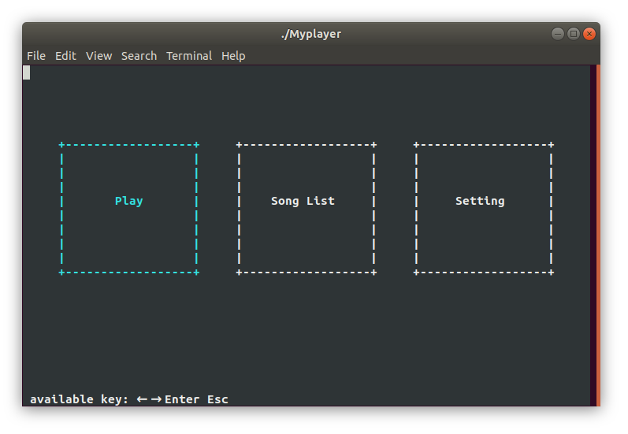
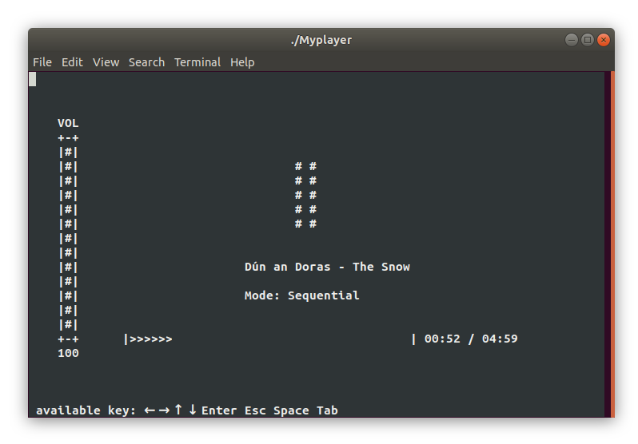
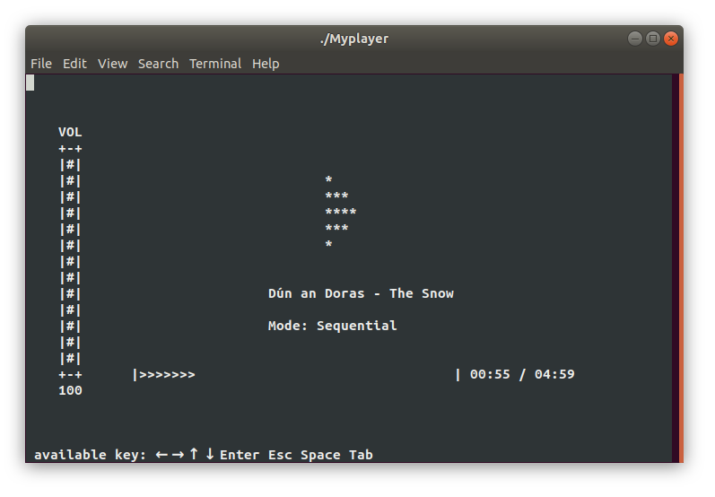
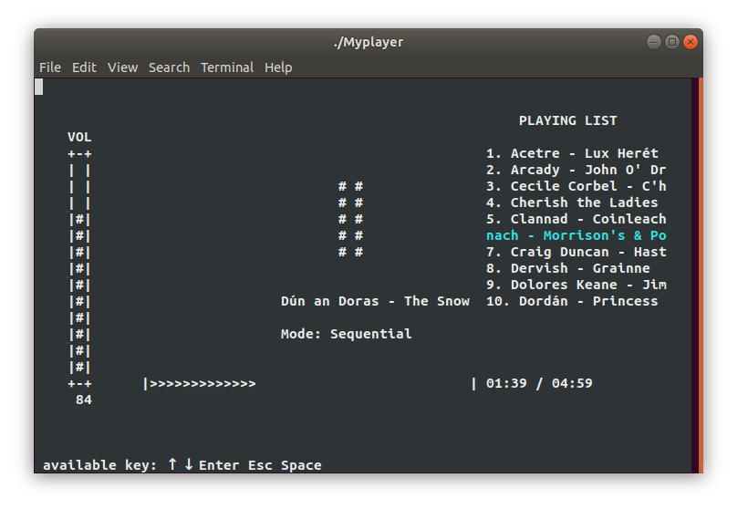
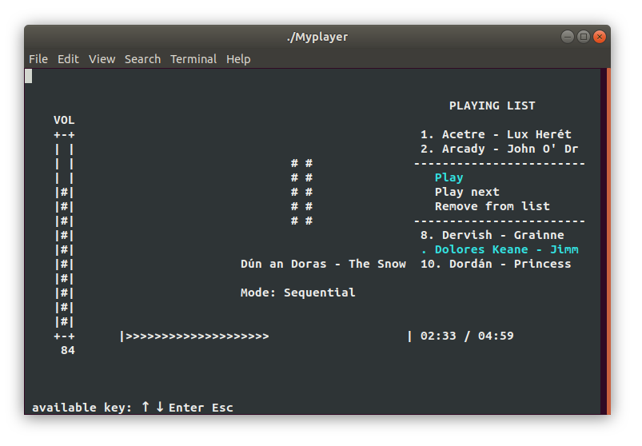
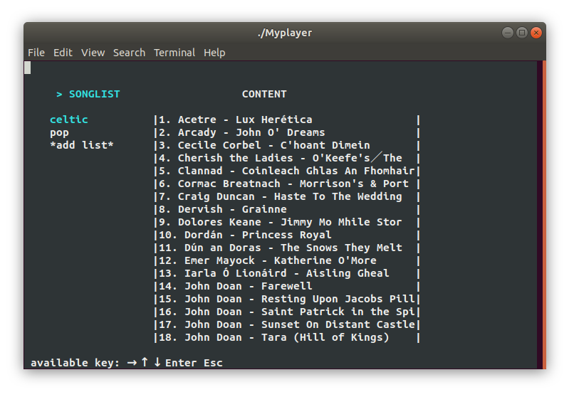
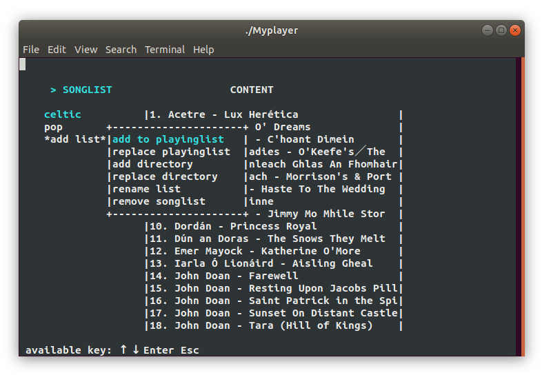
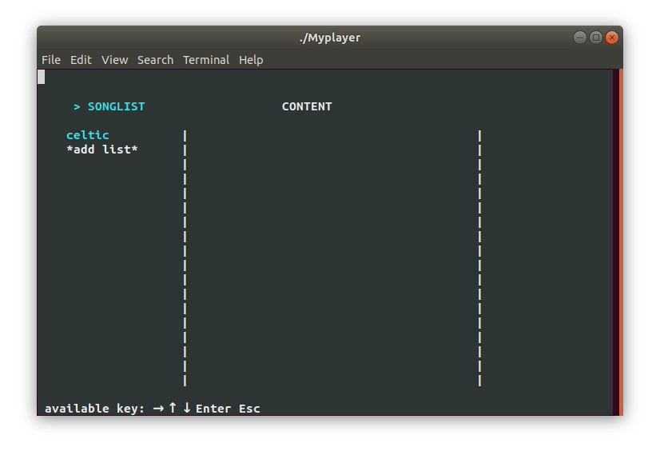
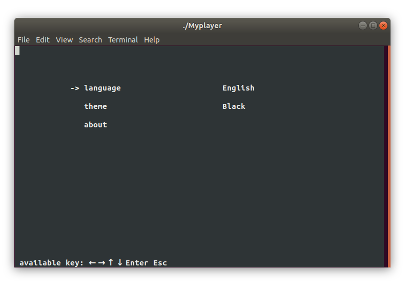

# CMu6Box
A music box based on terminal.


## Build

### Requirements

- Ncurses library for CUI
- Qt dev tools for multimedia


### Install The Ncurses Library

```sh
sudo apt-get install libncurses5-dev libncursesw5-dev
```


### Build The Qt Application

```sh
mkdir build && cd build
qmake ../Myplayer.pro
make
```


### Run It

```sh
./Myplayer
```





## Character User Interface

### Playing && Pause






### Play List && Edit






### Song List && Edit






### Directory Walking




### Setting



