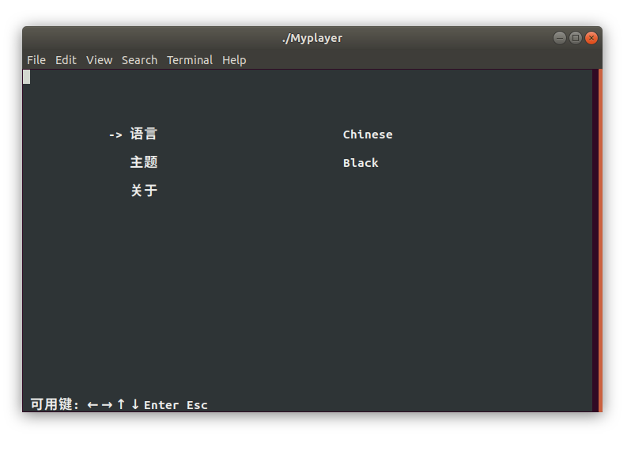

# CMu6Box
A music box based on terminal.


## Build

### Requirements

- Ncurses library for CUI
- Qt dev tools for multimedia


### Install the Ncurses library

```sh
sudo apt-get install libncurses5-dev libncursesw5-dev
```


### Build the Qt application

```sh
mkdir build && cd build
qmake ../Myplayer.pro
make
```


### Run it

```sh
./Myplayer
```


## Character User Interface

### Playing & Pause


### Play List & Edit


### Song List & Edit


### Directory Walking


### Setting



